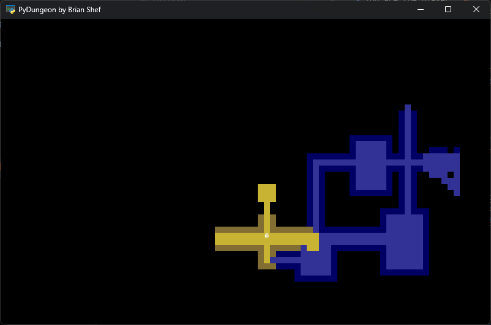

# pydungeon

A procedurally generated roguelike written in Python

## Development

1. Create the virtual environment with `$> python -m venv .venv`
1. Activate the virtual environment with `$> .venv\Scripts\activate.bat`
1. Install dependencies with `$> pip install -r requirements.txt`

## Running Locally

1. Run locally with `$> python main.py` or `$> ./main.py`
1. Deactivate virtual environment with `$> deactivate`

# References

- https://rogueliketutorials.com/tutorials/tcod/v2/
